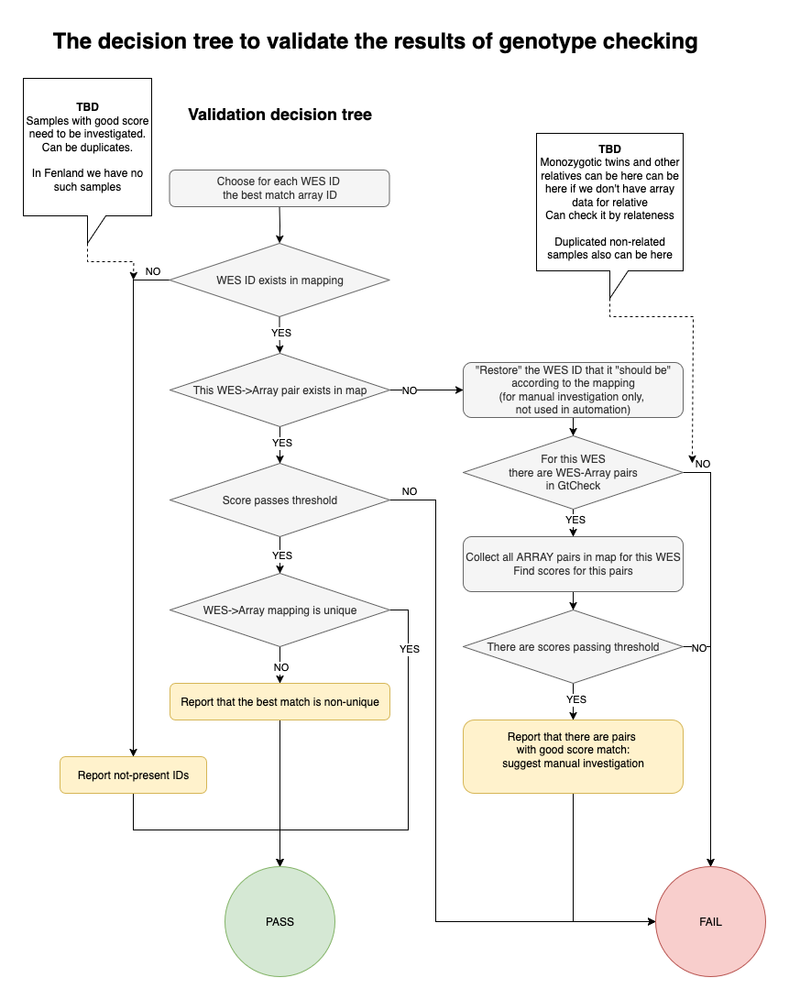

# Validate GtCheck results

If you have any independent genotype data, you can run validate consistency between genotypes.
This howto describes performing genotype validation using `bcftools gtcheck` utility
and the WxS-QC pipeline.
This step is optional any you can bypass it without any effect for downstream analysis.
However, the genotype validation is a very efficient way to identify
and exclude for the analysis mislabeled samples.

**Warning**: currently, the example public dataset doesn't have external genotypes.
The provided manual describes workflow used for clinical data that can't be openly shared.

## BCFtools validation

To run genotype validation, you need to have two VCFs:
* The sequences genotypes. This is the same VCFs that you used for the step 1.1 of WxS-QC pipeline.
  Example: `wxs-qc_public_dataset_v3.joint_germline.vcf.gz`
* External genotypes. This is the VCF with external genotypes.
  Example: `wxs-qc_public_dataset_v3.mcroarray_genotypes.vcf.gz`
  In this tutorial we assume that we use SNP-microarray for genotyping.
  You can convert microarray data to VCF using [PLINK](https://www.cog-genomics.org/plink/) utility.
  Please refer to the utility manual for details.

Run bcftools on these files
```bash
bcftools gtcheck --n-matches 10 --genotypes wxs-qc_public_dataset_v3.joint_germline.vcf.gz wxs-qc_public_dataset_v3.external_genotypes.vcf.gz
```

BCFtools gtcheck generates the gtcheck report report — for each sample from the first file,
it outputs 10 best matches from the second file.
The all-to-all comparisons could be time-consuming,
but this is the best way to catch all potential matches.
The example file for the internal testing dataset is avaliable
[here](https://wes-qc-data.cog.sanger.ac.uk/metadata/control_set_small.combined.gtcheck.txt)

In addition, you need to provide the following files for your external genotyping data:

* [wes_microarray_mapping](https://wes-qc-data.cog.sanger.ac.uk/metadata/control_set_small.microarray_mapping.tsv)
  -- the two-column tab-separated file,
  containing the expected mapping between WES/WGS and microarray samples.
  Usually, microarray studies have separated sample-preparation protocol and different IDs
  If your external genotypes use the same IDs as the sequencing data,
  Just provide the file with two identical columns.
* [microarray_ids](https://wes-qc-data.cog.sanger.ac.uk/metadata/control_set_small.microarray_samples.txt)
  -- the list (one ID per line) of IDs actually present in your microarray data.
  This file is expected to have the same set of IDs as in the mapping file.
  However, sometimes array genotyping for a particular sample fails,
  and in this case it is not present in the results.

Specify these files in the pipeline config.
You can use the entries `wes_id_col` and `microarray_id_col` is your mapping file has
custom column names.
```yaml
wes_microarray_mapping: '${cvars.metadir}/control_set_small.microarray_mapping.tsv' # Set to null if you don't have microarray data
microarray_ids: '${cvars.metadir}/control_set_small.microarray_samples.txt'
gtcheck_report: '${cvars.metadir}/control_set_small.combined.gtcheck.txt'
wes_id_col: 'WES_ID'
microarray_id_col: 'Microarray_ID'
```

Run the validation script:

```shell
python 1-import_data/3-validate-gtcheck.py
```

## Gtcheck validation results and interpretation:

The validation script implements complicated logic to ensure correctness of all data,
including provided inputs.
If you have any issues with interpreting validation results,
don't hesitate to contact the HGI team and ask for assistance.

At first, the validation checks the consistency of the mapping file and samples present in the data.
The script reports the IDs present in the mapping but not present in the real data, and opposite.
Also, it returns all duplicated IDs in the mapping.
After validation, the script removes from the mapping table all microarray IDs not found in the data.

Next, the script loads gtcheck table and runs a decision tree to split samples into passed and failed.



On each decision tree step, samples are marked by the specific tag in the `validation_tags` column.

The script exports the final table for all samples, and a separate file for the samples failed validation
under the gtcheck validation dir (specified in the config file in `gtcheck_results_folder` entry).
The tags in the `validation_tags` column allows tracking the chain of decisions for each sample.
The same mechanism allows developers to extend this script and add more decision steps if needed.

Here are all already implemented tags:

| tags                                                         | Description                                                                                                              |
|--------------------------------------------------------------|--------------------------------------------------------------------------------------------------------------------------|
| best_match_exist_in_mapfile, best_match_not_exist_in_mapfile | The matching gtcheck sample with the best score exists/not exists in mapping                                             |
| best_match_matched_mapfile, best_match_not_matched_mapfile   | The matching gtcheck sample with the best score is consistent/not consistent with the mapping file                       |
| score_passed,  score_failed                                  | Gtcheck score for the best matched sample passed/failed threshold check                                                  |
| mapfile_unique, mapfile_non_unique,                          | The matching array sample is unique/not unique in the mapping file                                                       |
| mapfile_pairs_have_gtcheck, no_mapfile_pairs_have_gtcheck    | There is at least one/there are no samples form the mapping file that were reported in the Gtcheck best matching samples |

## Investigation of failed samples

The WxS-QC pipeline reports samples as **passed** in all validation results are expected.
However, there are many cases when samples reported as **failed** are not real failures,
especially if the external genotype data are not complete.
We suggest that you investigate all failed samples and find out potential

### Several common reasons of false-positive failed samples
* The dataset contains monozygotic twins. The gtcheck can "swap" samples and report both of them as incorrect matches.
* The sequencing data contain a proband, that does not have an external genotype.
  However, the external genotype has data for a close relative of the proband
  The Gtcheck reports relative as a closest match, and the proband is labelled as missed samples
